# 学会使用这16个AI图像生成软件,五分钟搞定草图转照片

手绘了一个产品草图,想看看真实效果是什么样?设计师画了服装设计稿,需要给客户展示穿上身的样子?孩子随手涂鸦了一个角色,想把它变成精美插画?这些场景以前要么花大价钱找专业画师,要么就只能靠脑补想象。AI图像生成工具改变了游戏规则——上传草图,描述一下你想要的风格,几秒钟就能得到照片级的渲染图。从时尚设计到产品原型,从建筑可视化到儿童创意启发,这16个平台覆盖从免费到专业级的各种需求,帮你用最短时间把想象变成可以直接使用的高清图像。

## **[Draw3D](https://draw3d.online)**

草图一键转照片级真实图像,支持风景、动物、雕塑等多种场景,内置图像编辑器。

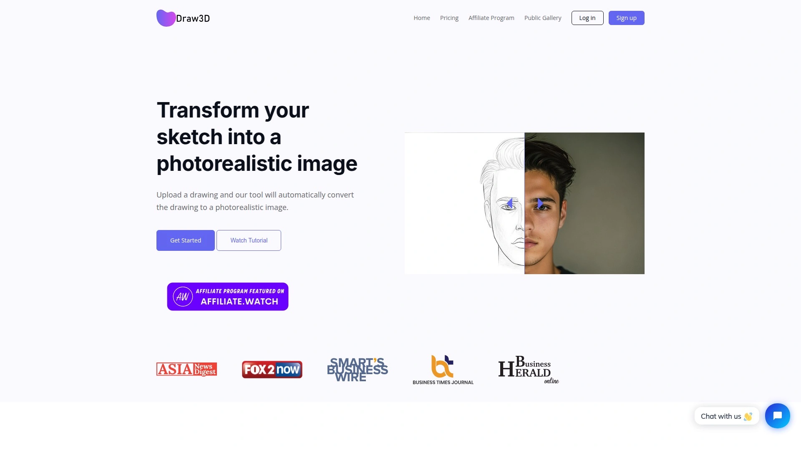

Draw3D的核心能力是处理任意细节程度的草图——无论你画得有多粗糙,它都能理解并生成对应的真实图像。可以是美丽的自然风光,可以是山脉景观,效果就像魔法一样。处理动物草图时特别擅长保持面部结构的准确性,你随便画个动物轮廓,AI能让它"活"过来。

还支持雕塑到照片的转换,而且是双向的——你可以把照片转成雕塑风格。使用流程超简单:画出或上传你想要的草图,Draw3D会帮你生成图像。生成的图像可以无损放大到4倍(8倍功能即将推出)。内置了简单但强大的图像编辑器,直接在平台内就能做滤镜和尺寸调整,不需要导出到第三方软件。适合需要快速把手绘概念转化为可视化素材的设计师、产品经理、建筑师。

## **[NewArc.ai](https://newarc.ai)**

专业级草图转图像平台,几秒内生成真实照片和3D渲染,适合建筑和产品设计。

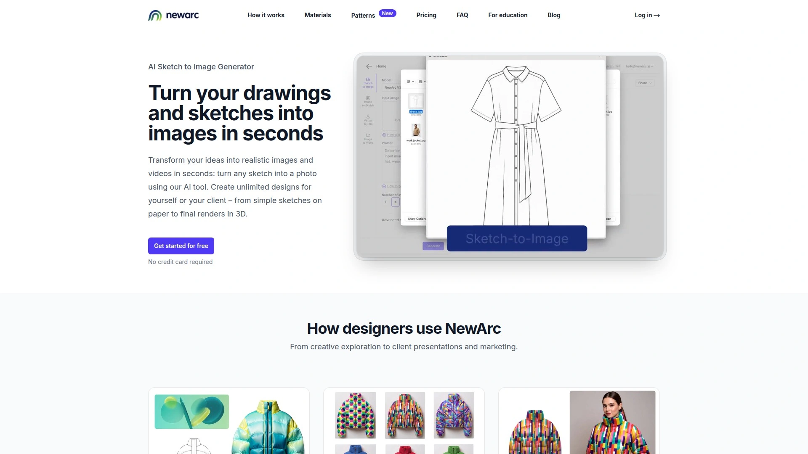

NewArc把草图可视化提升到专业级水平——上传任何草图,立刻得到逼真的照片或3D渲染效果。特别针对建筑设计和产品原型场景优化,生成速度快到让人惊讶。如果你是设计师,需要给客户快速展示概念方案的真实样子,NewArc能把提案过程缩短几天。渲染质量专业到可以直接用于正式演示文稿。

## **[Canva](https://canva.com)**

设计巨头的AI绘画工具Sketch to Life,从草图到成品只需三步,免费使用。

Canva的Sketch to Life功能把找图、选图、处理图的几小时工作压缩成三个快速步骤:草图、描述、生成。作为草图转图像的AI工具,它让你能快速创作,无论绘画技能如何。生成的AI照片需要编辑的话,Canva的AI照片编辑器能简化后期处理。

最大的优势是一体化平台体验——草图变照片后,可以直接把图像放到数百个模板中打印出来。从周边商品到营销材料,从贴纸到文具,AI生成的图像能立刻变成实体产品。集成Apple Pay,客户可以直接在聊天中完成交易。适合既需要生成图像又需要做平面设计的创作者。

## **[Fotor](https://fotor.com)**

全能型AI图像生成器,30多种艺术风格,支持草图转图像和文本生成图像。

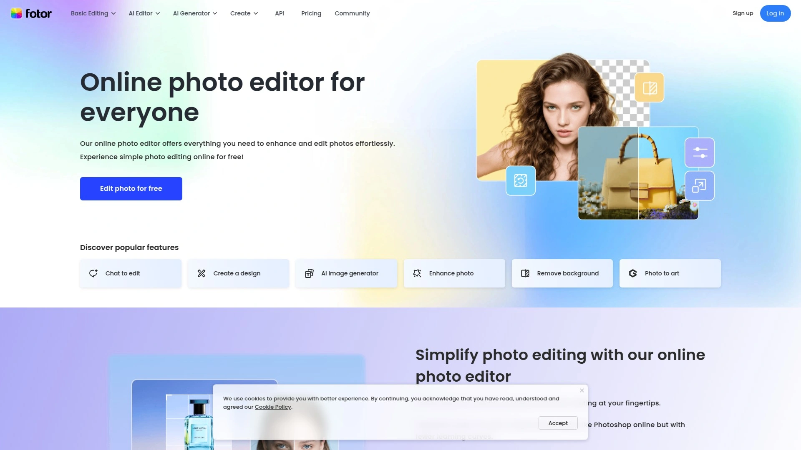

Fotor的AI草图转图像转换器能根据上传的粗略草图生成逼真的AI艺术作品,并以高分辨率导出。提供多种绘画和数字艺术风格,可以给草图应用各种艺术外观,从动漫、游戏艺术到水彩、油画都有。用户界面友好,操作直观,几次点击就能把粗糙草图变成逼真且令人惊叹的数字图像。

还提供大量有价值的编辑工具来微调AI绘图或草图,比如AI放大器、AI艺术效果、AI替换等。不需要使用第三方工具就能实现编辑目标。能从粗糙草图创建逼真的AI艺术,生成的图像可以高分辨率下载,适合在线分享和线下打印。完全免费,无需注册,没有水印。

风格模型范围广泛,允许风格定制——可以创作油画、水彩、中国传统绘画、幻想、未来主义、波普艺术、赛博朋克等无尽风格的艺术。无论想做卡通艺术、现代数字艺术、绘画还是科幻艺术,或者模仿不同艺术流派和时代的著名艺术家风格,Fotor都能满足。

## **[Adobe Firefly](https://adobe.com/products/firefly)**

Adobe出品的AI草图转图像生成器,与Photoshop深度集成,商业使用安全。

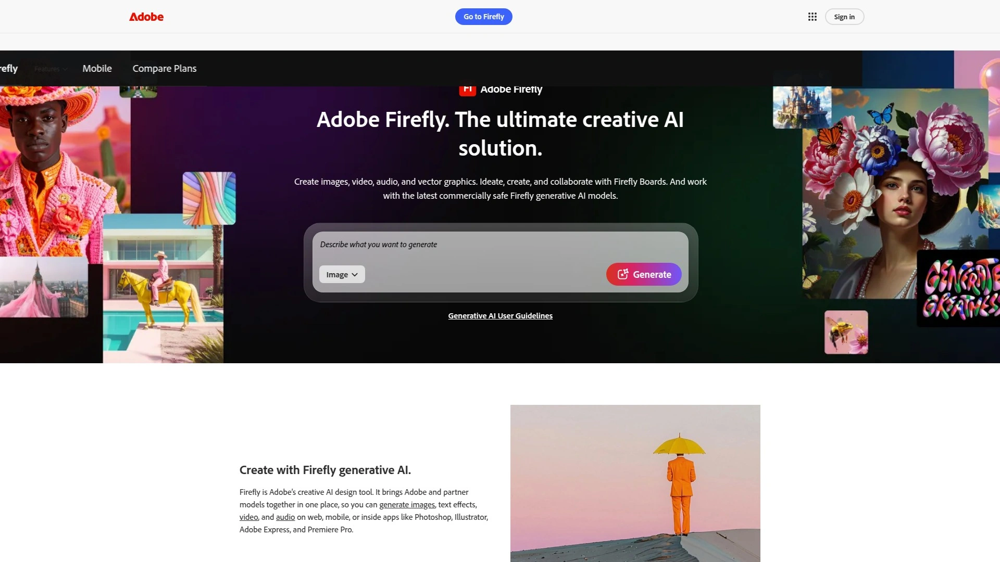

Firefly利用生成式AI工具的力量,能毫不费力地将简单草图转换成精致、专业品质的图像。AI草图转图像让你轻松投入创作过程,探索想法、迭代概念、实现想象——无论是处理粗略草图、详细素描还是线稿都没有限制。

跟随简单步骤就能使用Firefly直观的AI草图转图像生成器将草图转换成迷人的图像。AI草图转图像生成器能将简单草图转换成详细图片,分析草图、添加缺失细节、用颜色和纹理赋予生命。Firefly可以从各种类型的草图轻松创建逼真的数字艺术,AI理解形式、颜色和风格,生成与你愿景匹配的高质量图像。

如果你有想让AI图像生成器在渲染新图像时作为结构或风格灵感的参考照片,Firefly是最佳选择。能自动给演示文稿添加配音。商业使用安全——图像来自Adobe Stock创意库,意味着渲染的图像可以安全用于商业用途。

## **[Midjourney](https://midjourney.com)**

顶级AI艺术生成器,以高质量、逼真图像著称,提供强大定制和控制能力。

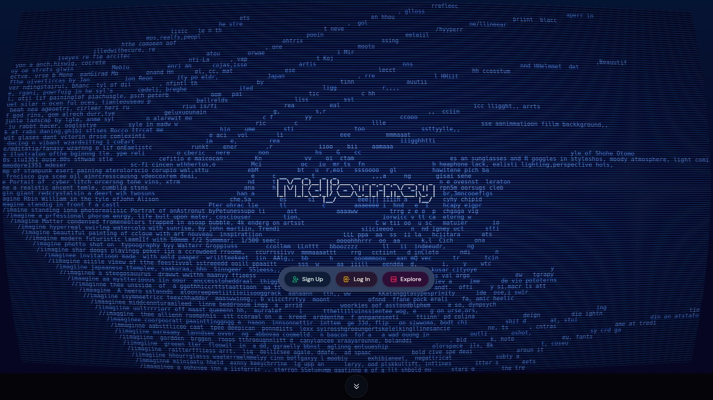

Midjourney以其创建始终如一的惊艳输出而闻名,擅长以各种风格制作高质量、逼真、细致的艺术作品。具有可定制参数,配备强大的高级编辑任务功能,如风格化级别、外部绘制、背景移除。外部编辑器功能支持编辑用户上传的图像。

虽然可能不提供像FAL、NightCafe和Leonardo那样广泛的模型或视频功能,但仍然是可靠且强大的AI图像生成器。以产生高度逼真的图像而闻名,为用户提供对输出的令人印象深刻的控制。在图像质量方面被评为优秀级别。

月订阅从每用户10美元起,包含200次图像生成。年订阅从每用户每月8美元起,提供20%折扣。适合对图像质量和艺术性要求极高的专业创作者。

## **[OpenArt](https://openart.ai)**

免费AI艺术生成器和编辑器,草图转图像功能完善,适合文本转图像创意。

OpenArt提供免费的照片生成器和编辑器,非常适合使用文本转图像提示将想法转换为令人惊叹的视觉效果。草图转图像功能让你上传任何草图——无论是萌芽中的艺术作品、室内设计概念还是产品创意——AI会迅速将其渲染成详细、逼真的图像。

从简单线条到复杂设计,AI都能将其转换成高质量图像。添加文本描述并调整细节直到满意,将草图变成用于设计项目、营销或创意作品的令人惊叹的视觉效果。适合需要快速迭代创意概念的设计师。

## **[ChatGPT (GPT-4o)](https://chatgpt.com)**

整体最佳AI图像生成器,结合准确性、便利性和质量,在ChatGPT界面内生成。

ChatGPT现在由GPT-4o驱动,让你在ChatGPT界面内轻松生成高质量图像,是艺术家、设计师和任何想创建独特原创内容的人的理想工具。原始的最佳AI图像生成器的升级版本。

虽然DALL-E 3和Midjourney以类似方式训练,但现在驱动ChatGPT的GPT-4o的训练方式略有不同。作为对话式工具使用体验流畅,图像生成能力嵌入在日常对话中。每月20美元的ChatGPT Plus订阅包含更少的限制。

## **[Leonardo AI](https://leonardo.ai)**

专业云端平台,游戏开发和3D艺术家的首选,纹理生成和运动功能强大。

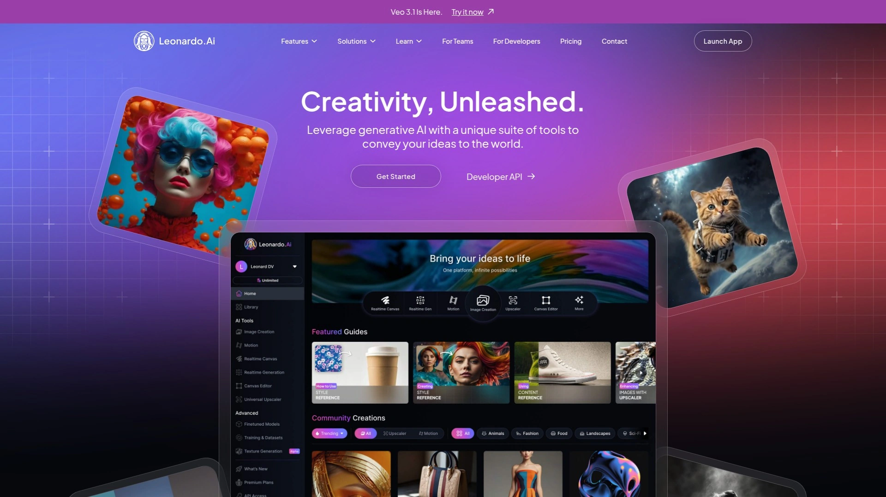

Leonardo.ai是专业的云端平台,配备专业工具。平台的纹理生成能力专门针对游戏开发者和3D艺术家,用户可以直接在Leonardo.ai内创建无缝纹理、法线贴图和材质集。运动生成功能增加了另一个维度,允许将静态图像动画化用于社交媒体或演示。

提供精心策划的模型选择,每个模型都针对特定用例优化。Phoenix模型擅长照片真实感,而专业模型处理动漫艺术、RPG资源或建筑可视化。这种策展确保一致的质量并减少决策疲劳,对需要快速可靠结果的专业人士特别有价值。

适合创意机构和创意团队,提供可靠性、专业工具和清晰的许可。许多专业人士同时使用多个工具——Leonardo.ai用于需要快速周转的客户工作。

## **[Stable Diffusion](https://stability.ai)**

开源AI图像生成器,完全可定制,技术用户的最爱,隐私和成本优势明显。

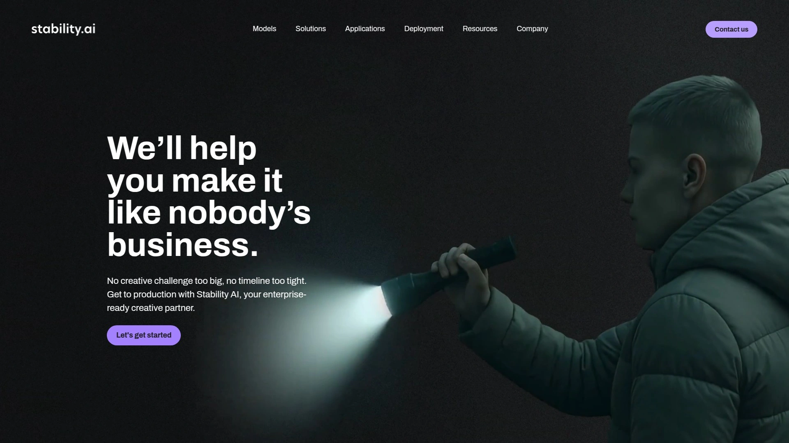

Stable Diffusion的优势在于其模块化生态系统,用户可以组合各种工具和扩展来创建定制化工作流。ControlNet通过深度图、姿势和边缘检测提供精确的构图控制。区域提示器扩展能为特定图像区域使用不同提示。像ESRGAN这样的放大模型无缝集成以实现高分辨率输出。

对于开发者,Stable Diffusion的开放性质能深度集成到现有管道中。模型可以嵌入应用程序、通过脚本自动化或部署在自定义基础设施上。这种灵活性使其成为构建AI驱动产品或服务的公司的首选。

生态系统通过Civitai和Hugging Face等平台提供数千个模型,用户可以找到训练于特定艺术风格、角色或概念的超专业化模型。奖励技术投资以无限可能性——对于适应设置复杂性的用户,它提供无与伦比的灵活性、隐私和长期成本效率。

## **[NightCafe](https://nightcafe.studio)**

一站式AI艺术生成平台,集成所有顶级AI模型,社区功能活跃。

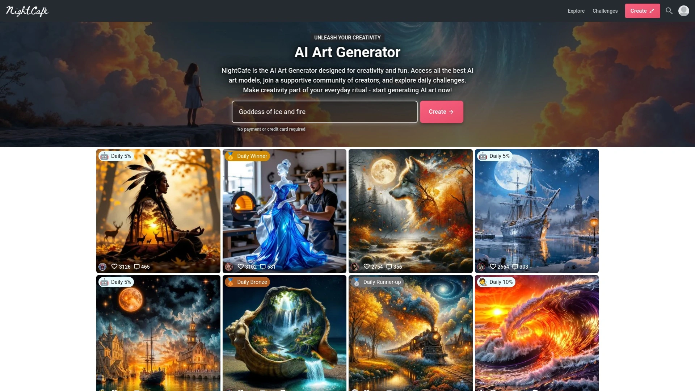

NightCafe每月被数百万人使用来创建、分享和讨论AI艺术。几个简单步骤就能创建AI图像和插图与朋友分享。与朋友开始或加入聊天室,然后协作进行AI艺术创作、即兴创作,或者只是在创意时闲逛。

集成了最新的Stable Diffusion基础和自定义模型及检查点、DALL-E 3、Stable修复以及所有其他前沿模型。NightCafe将始终是你最前沿AI图像生成的家园。提供无限制的基础Stable Diffusion生成,加上每日免费积分用于更强大的AI艺术生成器模型和设置。

特别支持Google Imagen 3.0模型,在NightCafe上以其渲染清晰、准确的文字而脱颖而出,非常适合需要大量排版的设计、logo或叙事视觉效果。擅长处理复杂提示,产生照片真实场景、数字卡通和富有想象力的艺术作品。

## **[Google Imagen 3](https://deepmind.google/technologies/imagen-3/)**

Google DeepMind出品,照片真实感和文字渲染准确度最佳的免费AI图像生成器。

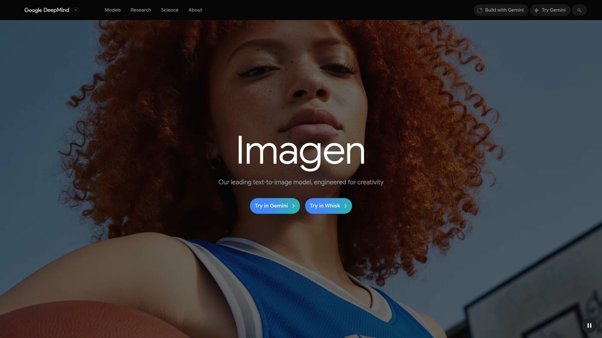

Google Imagen 3是DeepMind的先进AI模型,生成照片真实图像,具有精确的提示遵从和清晰的排版。基于先进的扩散技术构建,将详细的文本提示转换成具有清晰细节、丰富光照和最小瑕疵的高质量视觉效果。

产生照片真实场景、数字卡通和需要大量排版的设计,擅长处理复杂提示用于创意和专业用途。与其他模型不同,Imagen 3在图像内渲染清晰、准确的文字,非常适合logo、海报和叙事驱动的艺术作品。被ZDNET评为最佳免费AI图像生成器,因为它免费产生最高质量、最逼真的图像。

## **[Picsart](https://picsart.com)**

社交平台风格的AI图像生成器,创意效果丰富,社区功能活跃。

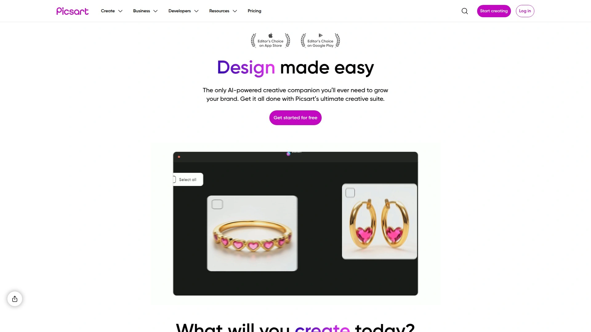

Picsart的AI图像生成器将文本提示转换成图像,在几秒钟内创建高质量视觉效果,无需绘画或摄影。是生成式AI领域的领导者,其AI照片编辑器包括AI图像生成器、AI替换以交换对象、AI扩展以延伸图像边界以及AI背景生成器以创建令人惊叹的背景。

提供受不同风格启发的各种AI艺术效果,可以应用独特的照片滤镜和效果将图像转换成数字绘画或充满活力的卡通漫画。提供批量编辑,允许一次编辑多张照片,可以同时裁剪、调整大小和放大多张图像,加快工作流程。擅长创意效果和社区功能。

## **[Craiyon](https://craiyon.com)**

完全免费且无限制使用的AI图像生成器,适合娱乐和简单社交媒体内容。

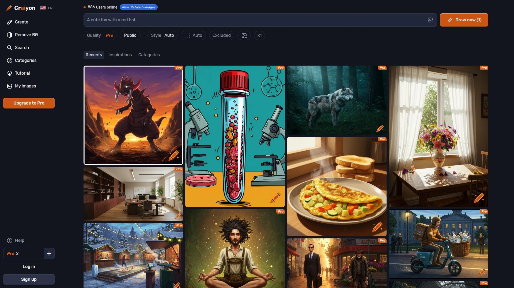

Craiyon是DALL-E mini的更新版本,虽然AI生成模型经过改进,但仍然与一些较新竞争对手有差距。测试中提示会有些混乱,但对于生成简单图像很有用,比如用于社交媒体。

像许多较老的AI图像生成器一样,它是AI艺术的好选择,因为不完美可以让艺术看起来更真实。如果你想玩AI艺术生成纯粹为了娱乐,Craiyon可能是最佳选择,因为它免费、无限制且易于使用。

## **[Hotpot AI](https://hotpot.ai)**

多功能AI创意平台,图像生成、AI头像、照片编辑一站式解决。

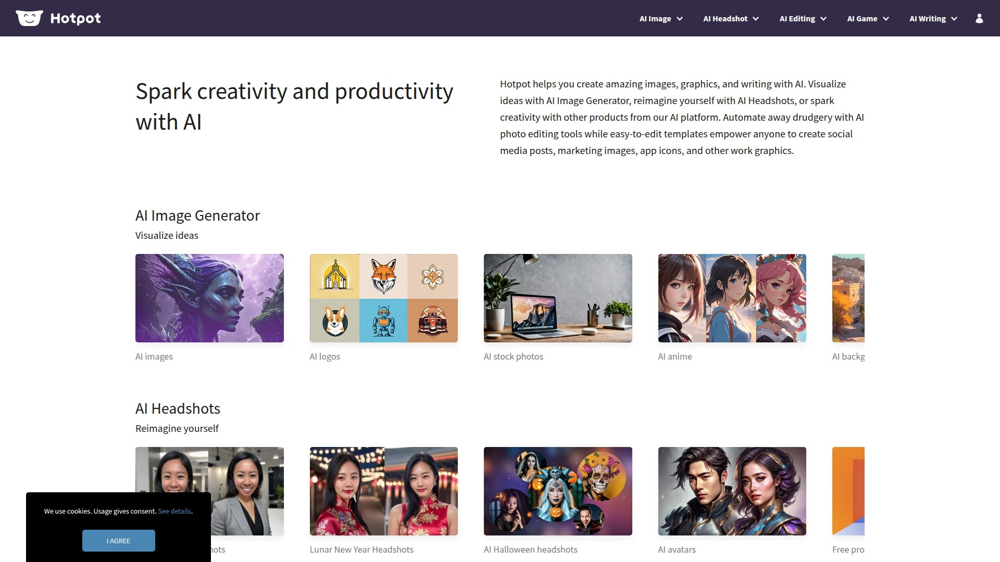

Hotpot帮助你用AI创建惊人的图像、图形和写作。用AI图像生成器可视化想法,用AI头像重新想象自己,或者用AI平台的其他产品激发创造力。用AI照片编辑工具自动化繁琐工作,易于编辑的模板让任何人都能创建社交媒体帖子、营销图像、应用图标和其他工作图形。

可以免费试用一张图像,之后必须购买积分,这也涵盖商业使用和高级编辑选项。测试显示它能生成真正高质量的图像,细节出色。可以为插图选择30种风格之一,给你大量创意自由。像大多数AI生成器一样,Hotpot在简单提示上效果最好。

## **[Jasper Art](https://jasper.ai)**

企业级AI图像生成工具,与Jasper AI写作平台集成,无限生成免版权图像。

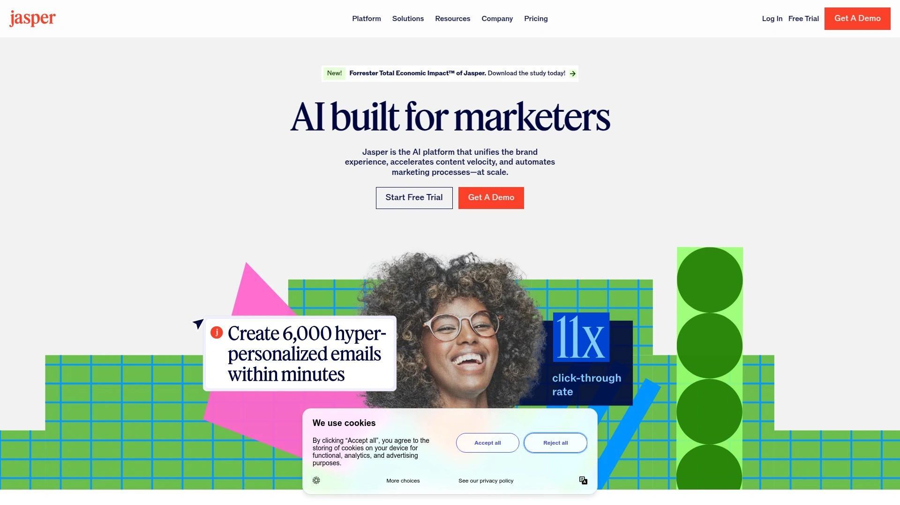

Jasper Art使用AI和机器学习的力量,通过简单的文本输入生成原创的免版权图像,可用于博客文章、社交媒体帖子、广告、邮件等。后台使用DALL-E 2(机器学习模型),由OpenAI开发,从自然语言描述生成逼真的数字图像。

只要能在400个字符或更少描述它,就能用Jasper Art创建任何可以想象的东西。提供大量各种图像风格和输入可供选择:图像风格(3D渲染、插图、抽象等)、图像媒介(画布、木炭、古典油画、铅笔素描等)、艺术家/风格(苏斯博士、毕加索、南方公园、梵高等)、情绪(愤怒、多彩、令人兴奋、发人深省等)、关键词(黑白、特写、高度详细、照片级真实等)。

可以混合和搭配的各种风格/输入组合几乎无穷无尽,让想象力自由驰骋。最棒的是你可以获得无限图像生成,可以一直按创建按钮直到得到你需要的东西。界面简洁易用,生成图像速度快。

## **[Manus](https://manus.im)**

智能草图转照片转换器,三步创作流程,特别适合时尚设计和儿童创意。

Manus专为你设计——上传草图,从简单线条到复杂设计,AI会将其转换成高质量图像。添加文本描述并调整细节直到满意,将草图变成用于设计项目、营销或创意作品的令人惊叹的视觉效果。

对于时尚造型师,可以将手绘草图变成成品图像,节省绘画和上色时间,更多专注于时尚造型的创造力。对于有孩子的家庭,立即将孩子的草图变成令人惊叹的艺术,智能工具将简单绘图转换成逼真绘画,激发创造力和对艺术的热爱。

减少花在搜索、选择和处理库存照片上的时间,Manus将其简化为三步:草图、描述和生成。这个AI绘图工具无论你的绘画技能如何都能快速创建逼真照片。

***

## 常见问题

**草图转照片的AI工具准确度如何?**

取决于草图的细节程度和工具的训练数据质量。现代AI工具经过数百万个草图及其最终版本的训练,基本能"知道"如何填补空白、使用什么纹理、光照如何表现、什么颜色有意义。对于结构化内容(如产品设计、服装草图、建筑图),准确度能达到80-90%。抽象或艺术性草图可能需要多次尝试和提示词调整。大多数工具支持文字提示指导结果,比如"将其渲染成霓虹色的街头服饰外观"或"白色背景上的照片级真实运动鞋"。

**免费工具和付费工具的实际区别在哪?**

免费工具如Craiyon、Fotor基础版能满足简单社交媒体内容需求,但生成次数、分辨率、商业使用权限受限。付费工具如Midjourney、Adobe Firefly提供三个核心优势:更高的图像质量(细节、光照、真实感明显更好)、商业使用安全(图像来源合法可追溯)、批量生成和高级编辑功能(如纹理生成、动画化、API集成)。如果只是个人尝试或低频使用,免费工具够用;如果用于客户项目、产品设计或高频创作,付费工具能节省大量时间并避免版权风险。

**哪种工具最适合特定行业需求?**

时尚设计和产品原型推荐Leonardo AI或Manus,它们专门优化了纹理、材质和细节渲染。建筑和室内设计选NewArc.ai或Adobe Firefly,能生成专业级3D渲染。游戏和3D艺术用Leonardo AI,纹理生成和运动功能针对这个领域。儿童创意和教育场景用Manus或Draw3D,界面简单且结果有趣。营销和社交媒体内容选Canva或Picsart,生成后能直接做平面设计和批量编辑。

***

## 结语

这16个平台按自动化程度、生成质量、行业适配性综合排序,从完全免费到企业级解决方案都有覆盖。如果你需要快速把手绘草图变成照片级真实图像,无论是产品原型还是艺术创作,**[Draw3D](https://draw3d.online)**的一键转换功能和多场景支持能让你在五分钟内完成整个流程——它处理任意细节程度的草图,从风景到动物到雕塑都能准确识别,生成的图像支持4倍无损放大,内置编辑器让你直接调整滤镜和尺寸,不需要在多个软件之间来回导出导入。
